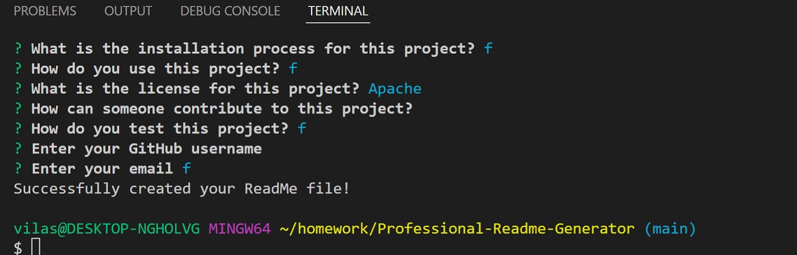

# Professional-Readme-Generator

## Description

This is an app that utilizes node to ask the user several questions which will then be used
to generate a readme file using their answers.

## Features

Multiple prompts that the user inputs into and a multiple choice list section which is
all presented with node through the console.

## Links

<a href="https://vilas-izquierdo.github.io/Professional-Readme-Generator/">Deployed Page</a>

<a href="https://github.com/vilas-izquierdo/Professional-Readme-Generator">GitHub</a>